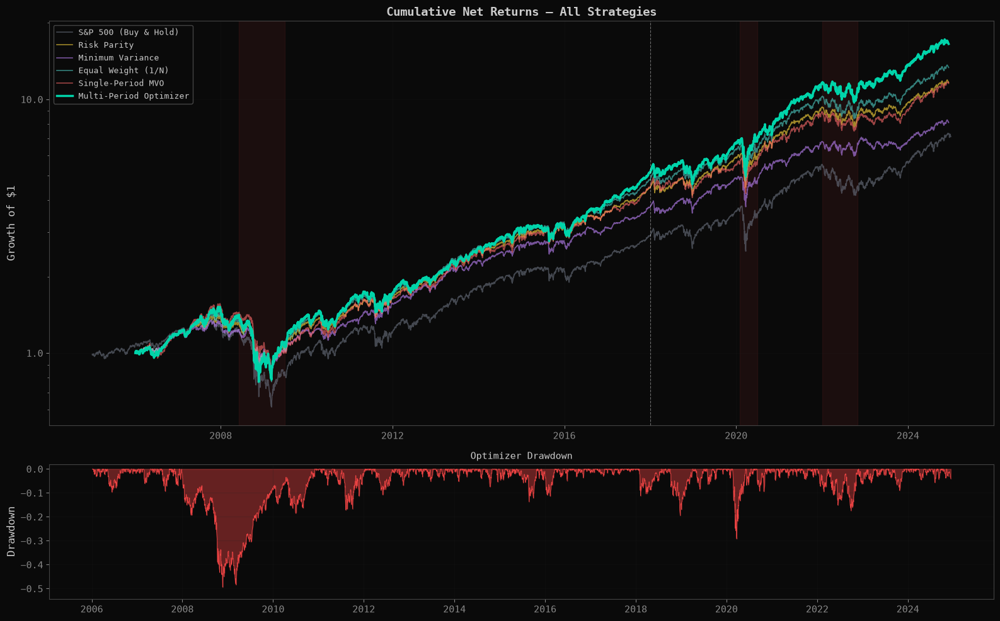
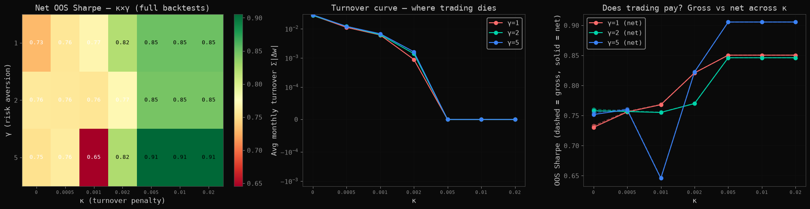

# Multi-Period Portfolio Optimization with Transaction Costs

**Hypothesis.** Multi-period convex optimization — expected returns from a
rolling Fama-French-3 model, Ledoit-Wolf covariance, an explicit 3/2-power
impact cost in the objective — should beat naive allocation once real
trading frictions are charged.

**Method.** CVXPY optimizer (long-only, 5% weight cap, turnover cap; the
objective charges *exactly* the cost model the backtest charges — machine-
checked contract, `tests/test_p1_cost_alignment.py`), walk-forward monthly
over 2005–2024 on 46 surviving large caps, against five hand-rolled
benchmarks under identical costs. IS 2005–2017 / OOS 2018–2024. Code:
[`src/portopt/`](projects/01_portfolio_optimization/src/portopt/).

**The optimizer's correct policy turned out to be restraint.**
At the documented baseline (κ=0.005) the optimizer never trades, and the
21-cell κ×γ grid shows why that is the answer rather than a bug: the freeze
boundary sits exactly at the baseline; below it the optimizer trades, costs
barely bite (gross−net ≤ 0.003 Sharpe), **and trading still doesn't pay**
(2/12 trading cells beat equal-weight OOS, within noise; even in-sample
selection prefers a frozen cell). Costs are irrelevant; **forecast quality
is the binding constraint.** The machinery built to refute DeMiguel et al.
(2009) ended up rediscovering it.




Numbers: [`results/tables/p1_metrics.md`](results/tables/p1_metrics.md),
[grid](results/tables/p1_kappa_gamma_grid.md) ·
Limitations: [`docs/LIMITATIONS.md`](docs/LIMITATIONS.md) (survivor
universe, ≈ +350–390 bp/yr selection premium) ·
Discipline: [`results/OOS_DISCIPLINE.md`](results/OOS_DISCIPLINE.md)

**Regenerate** (from repo root, data snapshots in `data/`):
```
jupyter nbconvert --to notebook --execute --inplace projects/01_portfolio_optimization/notebooks/exploration.ipynb
```

---

## Repository layout

- [`projects/01_portfolio_optimization/`](./projects/01_portfolio_optimization/) — the project: [`notebooks/exploration.ipynb`](./projects/01_portfolio_optimization/notebooks/exploration.ipynb) (the full narrative analysis, committed with outputs), `src/` (the extracted package), `config.yaml` (all parameters, schema-validated), `DESIGN.md` (the pre-registered spec), per-module tests.
- [`common/`](./common/) — shared library (data loading, metrics, causal HMM filter, plotting theme) used across the research program.
- [`tests/`](./tests/) — cross-cutting invariants: return-aggregation arithmetic, lookahead/leak detectors, cost-model parity.
- [`results/`](./results/) — citable figures and metric tables, the OOS discipline statement, the change log, and the full program report ([`QUANT_RESEARCH_GUIDE.pdf`](./results/QUANT_RESEARCH_GUIDE.pdf)).

## Setup

```
python -m venv .venv && source .venv/bin/activate
pip install -r requirements.lock
pip install -e ".[dev]"
pytest
```

Market data is downloaded on first notebook run and cached to `data/` (never committed).

## Authorship & tooling

This project was built with AI-assisted development (Claude Code). All methodology,
parameter choices, and research decisions are mine; every number-moving change has a
paper trail in [`results/CHANGELOG.md`](results/CHANGELOG.md), and every core result
is pinned by the test suite (`pytest` from the repo root). I can defend any line of
this code — that is the standard the whole repository is written to.

## Part of a three-project research program

This repository is one of three companion projects sharing the `common/` library and the same IS/OOS discipline:

1. [**Multi-Period Portfolio Optimization**](https://github.com/DR1PD/MultiPeriodPortfolioOptimization) — CVXPY, exact cost-model contract, the restraint result
2. [**Eigenportfolios via Random Matrix Theory**](https://github.com/DR1PD/EigenportfoliosRMT) — Marchenko-Pastur denoising, the five-probe tie
3. [**HMM Regime Detection**](https://github.com/DR1PD/HMMRegimeDetection) — causal filtering, the detector/strategy split

*by David Colindres*
